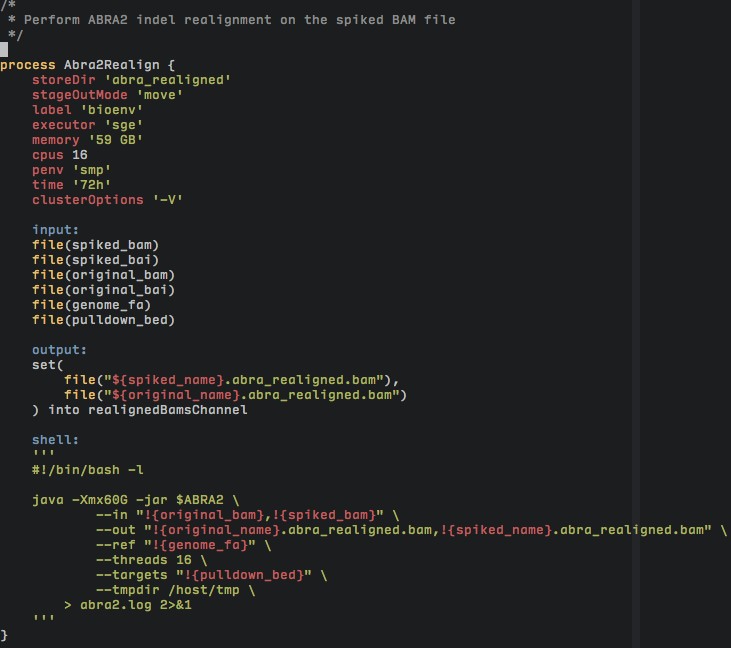

# Vim plugin for Nextflow workflows

Currently supports syntax highlighting of .nf scripts.

Extends (presumed-available) groovy syntax highlighting.

## Installation

### vim-plug

    Plug 'LukeGoodsell/nextflow-vim'

### Vundle

    Plugin 'LukeGoodsell/nextflow-vim'

### NeoBundle

    NeoBundle 'LukeGoodsell/nextflow-vim'

### Manual

    git clone https://github.com/LukeGoodsell/nextflow-vim.git
    for subdir in ftdetect ftplugin syntax; do
        mkdir -p ~/.vim/$subdir
        cp nextflow-vim/$subdir/* ~/.vim/$subdir
    done

## Goals

* language-specific highlighting of shell/script blocks.
* tab-completion
